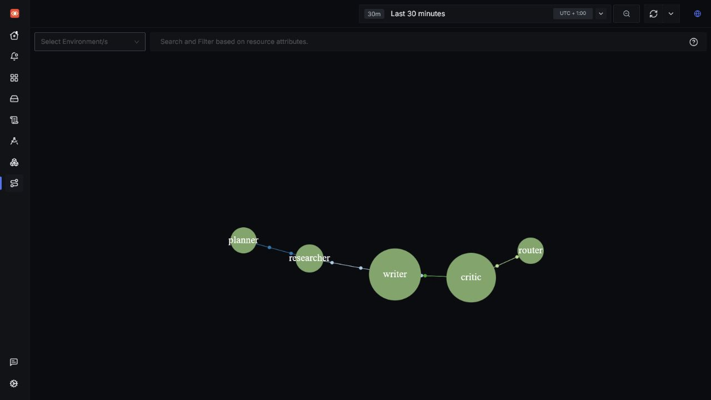

# Agent Mesh Radar

**See the hidden shape of a multi-agent system before a loop becomes an outage.**


<!-- Swap for docs/evidence/demo-beat.gif once the live beat is recorded (docs/DEMO.md, Recovery and evidence). -->

Agent Mesh Radar is an OpenTelemetry-first demo that turns agent-to-agent traffic into an
observable service mesh, then layers cost-per-edge, loop detection, an alert that pauses the
runaway agent, and an explain-this-loop MCP tool on top. `make demo` plays the whole
incident — cost climbs, edge turns red, alert fires, agent pauses, cost flatlines,
post-mortem prints — in under 90 seconds. The timed runbook is [docs/DEMO.md](docs/DEMO.md).

## Why this doesn't already exist

- **Live topology, not an execution graph.** Tools like Galileo aggregate one application's
  internal step graph across runs. This is a live network topology of *separate agent
  processes*, derived from vendor-neutral OpenTelemetry traces — any A2A-speaking agent that
  propagates `traceparent` shows up, regardless of framework or vendor.
- **The blind spot is real.** Agent-*to*-agent topology is unaddressed across the current
  observability landscape; even the A2A protocol lists tracing and monitoring as a stated
  but unmet goal.
- **The map comes for free.** The Service Map is derived by SigNoz from ordinary trace
  parent/child relationships plus `service.name` — no custom UI was built. Our work is what
  we layer on it: cost per edge, two-tier loop detection, enforcement, and explanation.

## Quickstart

### Prerequisites

- WSL 2 with a native Docker Engine and Docker Compose v2.20+ (the compose file uses
  `include`). SigNoz documents Docker Desktop on native Windows as unreliable for
  ClickHouse Keeper.
- At least 4 GB of Docker memory (8 GB recommended).
- [uv](https://docs.astral.sh/uv/getting-started/installation/) for Python tooling.

Start the complete observability stack:

```sh
make up
```

`make up` starts the local official SigNoz MCP server without a stored secret.
For Terraform-managed alert provisioning and live MCP queries, SigNoz requires a
supported credential; see [docs/DEMO.md](docs/DEMO.md). Then run `make demo` for
the bounded incident beat.

Open [http://localhost:8080](http://localhost:8080). The bundled collector accepts OTLP gRPC
on `localhost:4317` and OTLP HTTP on `localhost:4318`.

```sh
make test
make lint
make down
```

If uv is unavailable, install it with `curl -LsSf https://astral.sh/uv/install.sh | sh`.
For a limited pip-based fallback, create a Python 3.12 virtual environment and install the
development tools listed in `pyproject.toml`; the committed `uv.lock` remains the supported,
reproducible workflow.

## Layers

- **Instrumented-demo layer** (`agents/`) — independently runnable agents, one OTel service each.
- **Detection layer** (`detection/`) — reads telemetry to detect loops and budget breaches.
- **MCP-tool layer** (`mcp_tool/`) — explains observed loops through SigNoz.
- **Shared foundation** (`src/amr/`) — small cross-cutting helpers with no layer coupling.

Layers never import each other’s internals; they communicate through OTLP, HTTP, and SigNoz.
The full diagram and data flow are in [docs/ARCHITECTURE.md](docs/ARCHITECTURE.md);
`tests/test_detection_architecture.py` enforces the boundary.

## Six signals, all live

Every SigNoz signal is exercised by the demo, not merely configured
(`tests/test_six_signals.py` asserts each one):

| Signal | How we use it |
|---|---|
| Traces | One distributed trace per conversation across five named agent services, W3C `traceparent` on every A2A hop; the writer↔critic cycle is visible in the waterfall |
| Metrics | SigNoz-derived RED metrics (`signoz_calls_total`, `signoz_latency_bucket`) drive edge call-rate and P95 latency on the cost-per-edge dashboard |
| Logs | Trace-correlated `agent_reasoning`, `loop_detected`, and `agent_paused` events, filterable by `trace_id` and `conversation_id` |
| Dashboards | Three focused JSON exports: cost per edge, cost per agent, conversation budget |
| Alerts | Loop and budget rules plus a route policy, provisioned via the official Terraform provider; the webhook drives the controller's pause |
| MCP | `explain_this_loop(trace_id)` queries the official SigNoz MCP server and returns a grounded post-mortem |

Plus the headline: the **Service Map** itself is derived by SigNoz from trace
parent/child + `service.name` — the agent mesh renders with zero custom UI.

## SigNoz deployment

The repository commits Compose rendered by Foundry `v0.2.11` from
`deploy/signoz/casting.yaml`, with SigNoz pinned to `v0.128.0`. Normal development only needs
Docker Compose; see [the SigNoz deployment notes](deploy/signoz/README.md) to regenerate it.

## Cost dashboards

Import the three JSON files in `signoz/dashboards/` through **Dashboards → New dashboard →
Import JSON**. Each asks one question, keeps the primary KPI top-left, uses USD to four decimal
places, and applies green/amber/red thresholds. They intentionally use span attributes and Query
Builder sums, not a separate metric pipeline:

- `cost-per-edge.json` sums `agentmesh.cost.usd` only on `a2a.call` CLIENT spans, grouped by
  `agentmesh.src` and `peer.service`.
- `cost-per-agent.json` sums direct chat-span cost by `service.name`.
- `conversation-budget.json` sums direct chat-span cost by `gen_ai.conversation.id`; PLAN 05
  should query this total for its authoritative budget threshold.

An A2A server returns `result._meta.cost_usd`: its direct chat cost plus every downstream result
cost. Its caller writes that number on the single hop span, so edge costs represent the callee
subtree without double-counting. The edge dashboard also includes P95 latency and call rate from
SigNoz's derived `signoz_latency_bucket` and `signoz_calls_total` metrics.

The default demo model is `gpt-4.1-mini`; update `config/pricing.yaml` when changing the model or
when provider pricing changes. Unknown models are explicitly tagged `agentmesh.cost.unpriced=true`
with a USD cost of `0.0`.

## Grounded loop explanation

`mcp_tool.server` exposes `explain_this_loop(trace_id)` for an MCP host. It calls the official
local SigNoz MCP server's read-only query tool—not ClickHouse or a direct SigNoz REST path—and
returns observed cyclic agents, A2A hop count, and direct-chat cost.
A pause action is deliberately `null` unless an audit-log lookup establishes it; the tool never
manufactures enforcement facts from topology alone.

Start the MCP endpoint with `uv run python -m mcp_tool.server`; its command-line equivalent is
`uv run amr explain <trace-id>`, which formats a readable incident post-mortem rather than dumping
raw JSON.

## Limitations and roadmap

Honest edges of the current build:

- **Alert delivery in the no-secret demo is substituted.** `make demo` verifies the real
  loop-watcher signal in ClickHouse, then delivers the Alertmanager-shaped webhook to the
  controller itself; SigNoz performs that hop only in `make demo-full`, which needs a
  supported SigNoz credential. The substitution is printed loudly when it happens.
- **Notification channels are a provider gap.** The official SigNoz Terraform provider
  manages alert rules and route policies but not notification channels; the webhook channel
  is a one-time UI step.
- **Detection is polling, not streaming.** The loop-watcher polls ClickHouse (default every
  5 s); detection latency is bounded by the poll interval plus ingest lag.
- **The default LLM is fake.** Deterministic token counts make the demo reproducible; real
  providers plug in via `AMR_LLM`, but pricing coverage is only as good as
  `config/pricing.yaml`.
- **Cycle detection is per-trace.** Cross-conversation loops (an agent ping-ponging across
  separate traces) are out of scope for now.

Roadmap: SigNoz-native alert delivery in the default path once service-account keys land in
Community edition, cross-conversation loop detection, per-tenant budgets, and a resume
policy (auto-resume after N minutes with a tightened budget).

## Credits

Built on [SigNoz](https://signoz.io/),
[OpenTelemetry](https://opentelemetry.io/),
[A2A](https://a2a-protocol.org/), and
[OpenLLMetry](https://www.traceloop.com/openllmetry).

## License

Apache-2.0. See [LICENSE](LICENSE).

