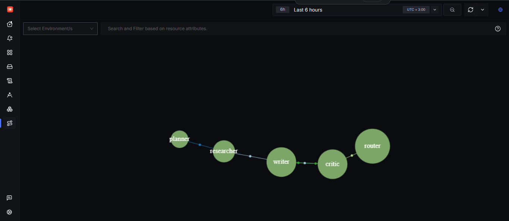
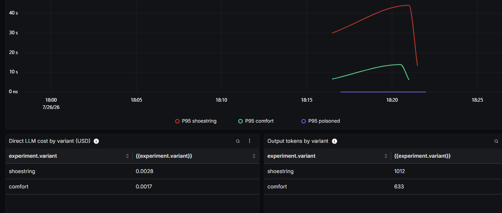

# taraol

**Drop-in OpenTelemetry for multi-agent systems — and AgentLab, the experiment layer that
tells you which agent design to deploy.** Any Python agent gets gen_ai-semconv spans,
cross-process `traceparent`, cost rollup, a live SigNoz topology, and a self-defense toolkit
(runaway-loop detection, per-edge circuit breaker, injection taint, bad-output provenance) —
from two decorators. Framework-neutral, **private by default**.

> Built for the "Agents of SigNoz" hackathon. Everything below is live-verified against a
> real SigNoz + real Gemini.



## Install

```sh
pip install taraol            # core: OTel SDK + gRPC OTLP + pyyaml
pip install "taraol[all]"     # + a2a, detection, mcp, search, llm, http extras
```

**Backend:** point `OTEL_EXPORTER_OTLP_ENDPOINT` at any SigNoz (Cloud or self-hosted), or boot
one locally — the wheel ships a reproducible Foundry deploy:

```sh
taraol signoz up      # local SigNoz (UI :8080, OTLP :4317); `signoz down` to wipe
```

## Two decorators are the instrumentation

```python
from taraol import instrument, agent, chat, tool

instrument("planner")                         # OTel wired, zero config

@tool                                         # execute_tool span; str return captured
def search(query): ...

@chat("gemini-2.5-flash")                     # tokens + cost read off the returned response
def think(prompt):
    return client.models.generate_content(model="gemini-2.5-flash", contents=prompt)

@agent(name="planner")                        # invoke_agent span around the step
def plan(task):
    return think(search(task)).text
```

Return the raw SDK response from a `@chat` function and usage + cost are extracted
automatically (google-genai, OpenAI-compatible, Anthropic, and flat result shapes). Agents that
propagate `traceparent` render as the live **Service Map** above. Need per-request control
(dynamic conversation ids, span handles)? The context-manager tier does the same:
`with kit.agent("planner", conversation_id), kit.chat(model) as c: ...` — see the mesh demo.

## Private by default, inspectable on demand

No prompt/output/tool text is ever captured unless you opt in (`OAK_CAPTURE_CONTENT=on`).
Opted in, `@chat` captures prompt + completion off the function automatically
(`gen_ai.input/output.messages`, truncated, standard semconv) — and the replay renders any
trace as readable text:

```sh
taraol explain <trace-id> --replay
```
```
[2] researcher   (113->21 tok, $0.0001)
    input:  You are the researcher agent (step 1). ...
    output: Tracing matters because it delivers crucial end-to-end visibility...
    tool search_sources: -> [3 results]
```

## AgentLab — compare AI agent variants with one function call

Which prompt, model, or workflow is cheaper, faster, and *safer to run*? AgentLab tags every
span + signal with `experiment.id` / `variant` / `run_id`, fires the same workload once per
variant, and compares them on real telemetry — cost, latency, tokens, **runaway loops, breaker
trips, failures** — not answer quality. **SigNoz is the dashboard.**

```
variant A ─┐                           cost · latency · tokens
variant B ─┼─ AgentLab run ──> SigNoz ── loops · breakers · fails ──> pick the safest
variant C ─┘  (one run_id)             dashboard + summary CLI
```

```python
from taraol import Experiment

(Experiment("docs-assistant", description="terse vs verbose prompt", author="Fraol")
    .compare("terse",   prompt="Explain OpenTelemetry in exactly one sentence.")
    .compare("verbose", prompt="Explain OpenTelemetry in three detailed paragraphs.")
    .compare("broken")                        # a failing variant is recorded, not fatal
    .run(ask))                                # ask(ctx) runs once per variant
```

One `.run()` = one shared `run_id` (Experiment → Run → Variant → Trace), so repeated runs never
blur. Compare in the terminal or import the bundled **experiment-comparison** dashboard:

```sh
taraol experiment summary converge-vs-runaway --run <run_id>
taraol experiment diff <run1> <run2>          # cost/latency/loops deltas between runs
```

```
variant       cost$   tokens  agents   avg ms  loops  breakers  fails  health
baseline     0.0116     4127       5    42460      0         0      0    91.5
runaway      0.0266     9457       5   130972      1         1      0    58.8

Highest Operational Health: baseline
```

That table is a real run: the runaway variant cost 2.3×, ran 3× longer, and the kit's watcher
caught its loop **from telemetry** and tripped the breaker. `HealthScore` is pluggable
(`100 − 10·loops − 5·breaker − 0.2·latency_s − 0.1·cost − 20·fails`) and "highest health" is a
factual read, not a universal winner.



## Self-defense toolkit

```python
from taraol.breaker import get_registry, edge_key
from taraol.guardrail import INPUT, scan

get_registry().allow(edge_key("writer", "critic"))   # per-edge circuit breaker
scan(fetched_docs, INPUT)                            # jailbreak/injection patterns
kit.mark_injection("jailbreak")                      # taint the span; spreads via baggage
```

The `[detection]` extra ships a **watcher** (reads SigNoz, flags runaway loops / budget
breaches / injection blast-radius / unhealthy edges — signals carry the experiment variant) and
a **controller** (SigNoz alert webhook → pause the agent or trip a breaker → trace-correlated
audit). Analysis helpers: `find_cycles`, `find_directed_cycles`, `origin_of_bad_output`.

## The demos (a ladder)

| demo | scale | shows |
|---|---|---|
| [`main.py`](main.py) | 1 agent, 1 process | quickstart + prompt A/B experiment |
| [`main_2.py`](main_2.py) | 3 agents, 1 process | revision loop → breaker; guardrail catches injection |
| [`demos/trip_planner/`](demos/trip_planner/) | 4 agents, 1 process | a real-life app on the decorator tier |
| [`demos/research_mesh/`](demos/research_mesh/) | 5 services, containers | cross-process traces, Service Map, watcher detection, alert → controller enforcement |

The mesh is the distributed story: `docker compose -f demos/research_mesh/compose.yaml up -d
--build`, then `python -m research_mesh.experiment` fires converging-vs-runaway and the watcher
catches the storm. Its SigNoz ships as a committed, reproducible **Foundry** deploy
([`casting.yaml`](demos/research_mesh/signoz/casting.yaml) +
[lock](demos/research_mesh/signoz/casting.yaml.lock)):
`foundryctl cast -f demos/research_mesh/signoz/casting.yaml`.

## Configuration

Zero-config defaults; override via `instrument(...)`, `Settings`, or env.

| Setting | Default | Env |
|---|---|---|
| `capture_content` | `False` | `OAK_CAPTURE_CONTENT` |
| `attr_namespace` | `agentmesh` | `OAK_ATTR_NAMESPACE` |
| endpoint | — | `OTEL_EXPORTER_OTLP_ENDPOINT` |
| A2A hop timeout | `10s` | `OAK_A2A_TIMEOUT_SEC` |
| experiment tags | off | `OAK_EXPERIMENT_ID / _VARIANT / _RUN_ID` |

**Guarantees:** `ParentBased(ALWAYS_ON)` sampling; no content capture by default (variant knob
values included); `gen_ai.*` keys are standard semconv, never namespaced; core install is
web-dependency-free.

Apache-2.0.
