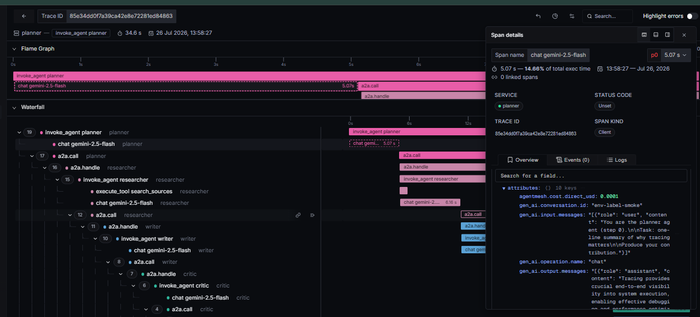

# Taraol

> **Observe, debug, defend, and improve AI agents with SigNoz.**

Taraol is an **OpenTelemetry-native observability framework for AI agents**. With only **two
decorators**, any Python agent becomes observable, experimentable, and self-defending — traces,
token/cost tracking, a live Service Map, operational experiments, loop detection, and circuit
breakers — all inside **SigNoz**, with no custom UI.

Framework-neutral, vendor-neutral, **private by default**. Built for the **Agents of SigNoz
Hackathon**; every number and screenshot below is from a real, live-verified run.


---

## The problem

Modern AI apps are no longer a single prompt — they're **teams of collaborating agents**. And
they fail in ways normal software doesn't:

- two agents get stuck **revising each other forever** — every loop is a real LLM bill;
- a poisoned document **injects instructions** that spread silently to every downstream agent;
- in a distributed system, **no single agent can see the problem** — only the telemetry can.

And a second question: with two prompts, two models, or two workflow designs — **which one
should I actually deploy?** Not which writes nicer text; which is cheaper, faster, and safer.

Traditional observability answers infrastructure questions. LLM-eval tools answer quality
questions. **Neither explains how the whole agent system behaves.** That's what Taraol solves —
in four verbs:

| | |
|---|---|
| **Observe** | every agent, tool, model call, token, and cost becomes an OpenTelemetry trace in SigNoz |
| **Debug** | replay any conversation — prompts, completions, tool I/O — from telemetry |
| **Defend** | detect runaway loops, injection spread, and budget burn; cut them with circuit breakers |
| **Improve** | AgentLab compares agent designs on real telemetry and tells you which to ship |

---

## Features

- 🔍 **End-to-end distributed tracing** — gen_ai semantic conventions, W3C traceparent across
  processes and machines. [Learn more →](docs/observability.md)
- 🗺️ **Live Service Map** — the real topology, drawn by SigNoz from traces. No diagram to
  maintain.
- 💰 **Automatic token & cost tracking** — read straight off the returned SDK response
  (google-genai, OpenAI-compatible, Anthropic, flat shapes).
- 🧠 **Prompt & response replay** — `taraol explain <trace> --replay`; opt-in, private by
  default. [Learn more →](docs/observability.md)
- 🧪 **AgentLab** — compare variants on cost / latency / loops / breaker trips / failures.
  [Learn more →](docs/agentlab.md)
- 🛡️ **Self-defending mesh** — loop detection, per-edge circuit breakers, injection taint,
  provenance, alert → enforcement. [Learn more →](docs/self-defense.md)
- ☁️ **Vendor-neutral** — plain OpenTelemetry; send to SigNoz today, any OTel backend tomorrow.
- 📦 **Reproducible backend** — one command boots a Foundry-deployed SigNoz.
  [Learn more →](docs/foundry.md)

---

## Quick start

```bash
pip install "taraol[all]"     # core is just `pip install taraol`
taraol signoz up              # local SigNoz (UI :8080, OTLP :4317) — or point at SigNoz Cloud
```

Instrument any agent with decorators — the function body stays your normal SDK call:

```python
from taraol import instrument, agent, chat

instrument("assistant")


@chat("gemini-2.5-flash")  # tokens + cost read off the returned response
def think(prompt):
    return client.models.generate_content(model="gemini-2.5-flash", contents=prompt)


@agent(name="assistant")  # invoke_agent span around the step
def answer(question):
    return think(question).text
```

That's the entire integration — no SDK wrappers, no monkey patching, no framework lock-in.
Content capture is **off by default**; opt in with `instrument(..., capture_content=True)` to
record prompts/completions under standard `gen_ai.*` keys. Need per-request control (dynamic
conversation ids, span handles, streaming)? The context-manager tier does the same —
[architecture →](docs/architecture.md).

---

## AgentLab — which design should I deploy?

Compare variants of the same workload on **operational** telemetry, not answer quality:

```python
from taraol import Experiment

(
    Experiment("docs-assistant", author="Fraol")
    .compare("terse", prompt="Explain OpenTelemetry in exactly one sentence.")
    .compare("verbose", prompt="Explain OpenTelemetry in three detailed paragraphs.")
    .compare("broken")  # a failing variant is recorded, not fatal
    .run(answer)
)  # runs once per variant, one shared run_id
```

Every span is tagged with the experiment + variant, so **SigNoz becomes the experiment
dashboard** (one ships in the package):


Or read it from the terminal — a real run on the distributed mesh (live Gemini):

```
$ taraol experiment summary converge-vs-runaway --run <run_id>

variant       cost$   tokens  agents   avg ms  loops  breakers  fails  health
baseline     0.0116     4127       5    42460      0         0      0    91.5
runaway      0.0266     9457       5   130972      1         1      0    58.8

Highest Operational Health: baseline
```

The runaway variant cost 2.3× and ran 3× longer — and the **loops / breakers** columns come
from the watcher detecting the storm *in telemetry*. Full details, hierarchy, and the pluggable
health score: [AgentLab →](docs/agentlab.md).

---

## Self-defending mesh

```
   Agents ──> OpenTelemetry ──> SigNoz ──> Watcher ──> Controller
                                              │            │
                                       loop_detected   pause agent
                                       edge_unhealthy  break edge
```

The `[detection]` extra ships a **watcher** that flags runaway loops, unhealthy edges, budget
breaches, and injection blast-radius **from telemetry**, and a **controller** that turns a
SigNoz alert into enforcement — pause the agent, trip a per-edge breaker, write a
trace-correlated audit event. [How it works →](docs/self-defense.md)

---

## Debug — replay any conversation

```bash
taraol explain <trace-id> --replay
```
```
[2] researcher   (113->21 tok, $0.0001)
    input:  You are the researcher agent (step 1). ...
    output: Tracing matters because it delivers crucial end-to-end visibility...
    tool search_sources: -> [3 results]
```

The same chain in SigNoz — flame graph, waterfall across five services, and the captured prompt
on the selected span:



---

## Architecture

```
        Application ──▶ @agent / @chat / @tool ──▶ Taraol SDK
                                                       │
                          OpenTelemetry (traceparent, gen_ai semconv, OTLP)
                                                       │
                                                     SigNoz
                                          ┌────────────┴───────────┐
                                    Dashboards / UI        Query API / ClickHouse
                                                                    │
                                                    Watcher ──▶ Controller
```

Two instrumentation tiers (decorators for the common path, context managers for fine control),
optional extras (`[a2a]`, `[detection]`, `[mcp]`, `[search]`), content-free by default, standard
`gen_ai.*` keys never namespaced. [Full architecture →](docs/architecture.md)

---

## Examples — from a single process to a distributed mesh

| demo | scale | shows |
|---|---|---|
| [`demos/trip_planner/`](demos/trip_planner/) | 4 agents, 1 process | decorator-tier quickstart · prompt/budget experiment · revision loop → breaker · guardrail catches injection |
| [`demos/research_mesh/`](demos/research_mesh/) | **5 services, containers** | cross-process traces · Service Map · watcher loop detection · alert → controller enforcement · Foundry deploy |

```bash
# single-process demo — real Gemini, one command:
uv run python demos/trip_planner/app.py

# the distributed story:
docker compose -f demos/research_mesh/compose.yaml up -d --build
docker exec research-mesh-planner-1 python -m research_mesh.experiment
```

---

## Why Taraol vs the alternatives

| capability | Taraol | typical LLM-eval / framework tracers |
|---|---|---|
| OpenTelemetry-native (traceparent, gen_ai semconv) | ✅ | varies — often proprietary SaaS |
| Works with any Python code, no framework ownership | ✅ | usually tied to one framework |
| Distributed multi-service agent mesh | ✅ | mostly single-process |
| Live Service Map | ✅ (SigNoz) | ❌ |
| Operational experiments (cost/loops/breakers per variant) | ✅ AgentLab | ❌ — they compare answer quality |
| Loop detection **from telemetry** | ✅ | ❌ |
| Per-edge circuit breakers · injection taint · provenance | ✅ | ❌ |
| Alert → automatic enforcement | ✅ | ❌ |
| Reproducible backend deploy (Foundry) | ✅ | n/a |

Evaluation tools answer *"which answer is better?"* Taraol answers *"which workflow is cheaper,
more stable, and safer — and should I deploy it?"*

---

## Documentation

- [Observability — instrumentation, tracing, cost, replay](docs/observability.md)
- [AgentLab — operational experiments](docs/agentlab.md)
- [Self-defending mesh — detection & enforcement](docs/self-defense.md)
- [Architecture & instrumentation tiers](docs/architecture.md)
- [Reproducible SigNoz with Foundry](docs/foundry.md)

## Configuration

Zero-config defaults; override via `instrument(...)`, `Settings`, or env. Key settings:
`OAK_CAPTURE_CONTENT` (content capture, off), `OTEL_EXPORTER_OTLP_ENDPOINT`,
`OAK_A2A_TIMEOUT_SEC` (hop timeout, 10s), `OAK_EXPERIMENT_ID/_VARIANT/_RUN_ID`.

**Guarantees:** `ParentBased(ALWAYS_ON)` sampling · no content capture by default · `gen_ai.*`
keys are standard semconv, never namespaced · core install is web-dependency-free.

Apache-2.0.
