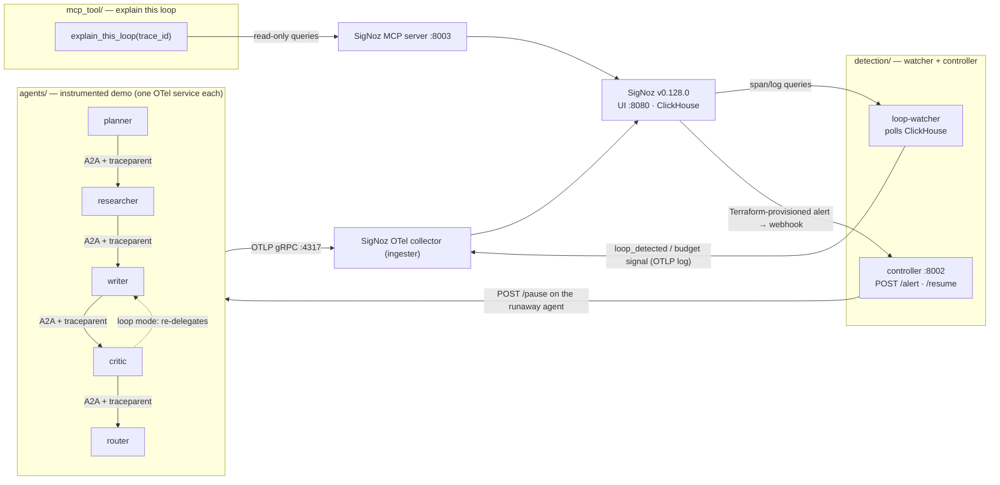

# Architecture

Four layers, one contract: layers never import each other — they communicate only
through OTLP, HTTP, and SigNoz. `tests/test_detection_architecture.py` enforces the
boundary.

## Data flow, end to end

1. **Agents** (`planner`, `researcher`, `writer`, `critic`, `router`) each run as their
   own container with a distinct `OTEL_SERVICE_NAME`, `parentbased_always_on` sampling,
   and `gen_ai.*` semconv opt-in. Every A2A hop injects W3C `traceparent` on send and
   extracts it on receive, so one conversation is one distributed trace. The planner is
   the single host entry point (`:8000`); all later hops stay on the private network.
2. **SigNoz** derives the Service Map, RED metrics (`signoz_calls_total`,
   `signoz_latency_bucket`), and trace/log views from those traces — no custom UI.
   Cost rides on span attributes (`agentmesh.cost.usd`).
3. **loop-watcher** polls ClickHouse for repeated-edge cycles and conversation budget
   breaches, emitting `loop_detected` and budget signals as trace-correlated OTLP logs.
4. **Alerting**: Terraform-provisioned SigNoz alert rules and a route policy deliver a
   webhook to the **controller**, which pauses the offending agent via its `/pause`
   control endpoint and writes an `agent_paused` audit log — again trace-correlated.
5. **mcp_tool** answers "explain this loop" for an MCP host by querying the official
   SigNoz MCP server (read-only); it reports cyclic agents, hop counts, and direct-chat
   cost, and claims a pause only if the audit log proves one happened.

## Runtime pieces (docker-compose.yml)

| Container | Layer | Host port |
|---|---|---|
| `planner`, `researcher`, `writer`, `critic`, `router` | agents | planner `:8000` only |
| `ingester` (SigNoz OTel collector) | telemetry | `:4317` gRPC, `:4318` HTTP |
| `signoz-signoz-0` + ClickHouse/Keeper/Postgres | telemetry | UI `:8080` |
| `loop-watcher`, `controller` | detection | controller `:8002` |
| `signoz-mcp` (profile `mcp`) | mcp_tool | `:8003` |

`docker-compose.demo.yml` is a demo-only overlay that exposes ClickHouse on
`127.0.0.1:8123` so `make demo` can verify the beat without a SigNoz API key.
